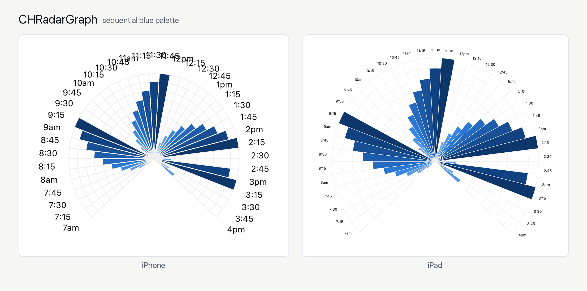

# CHRadarGraph

[](https://swiftpackageindex.com/cnharris10/CHRadarGraph)
[](https://swiftpackageindex.com/cnharris10/CHRadarGraph)

## Usage

To run the example project, open `Example/CHRadarGraph.xcworkspace` (or `Example/CHRadarGraph.xcodeproj`) in Xcode. The Example app depends on this package as a local Swift package, so no separate install step is required.

## Requirements
* iOS 13+
* Swift 6

## Example


## Installation

CHRadarGraph is available through the [Swift Package Manager](https://www.swift.org/documentation/package-manager/). To install
it, add it as a dependency in your `Package.swift`:

```swift
dependencies: [
    .package(url: "https://github.com/cnharris10/CHRadarGraph.git", from: "0.4.0")
]
```

Or add it via Xcode: **File > Add Package Dependencies...** and enter the repository URL.

## SwiftUI

`CHRadarGraphView` itself is a UIKit delegate/dataSource pair (mirroring `UITableViewDataSource`), which has no idiomatic SwiftUI entry point. For SwiftUI apps, `CHRadarGraph` (iOS 14+) wraps the whole thing behind a single `View` that just takes an array of sectors - no delegate/dataSource conformance required:

```swift
import SwiftUI
import CHRadarGraph

struct ContentView: View {
    @State private var selected: String?

    var body: some View {
        CHRadarGraph(
            sectors: [
                .init(height: 3, label: "Mon", color: .blue, labelColor: .primary, labelIsBold: true, labelFontSize: 14),
                .init(height: 7, label: "Tue", color: .blue),
                .init(height: 5, label: "Wed", color: .blue)
            ],
            title: "PRs created",
            titleColor: .secondary,
            titleFontSize: 20,
            onSelect: { sector, index in
                selected = "\(Int(sector.height)) on \(sector.label ?? "")"
            },
            onDeselectAll: {
                selected = nil
            }
        )
        .frame(maxWidth: .infinity, maxHeight: .infinity) // see note below
    }
}
```

`CHRadarGraph` wraps a plain `UIView` with no intrinsic content size, so SwiftUI will collapse it to zero size unless you give it an explicit frame (as above) or place it somewhere that already constrains its size, e.g. inside a fixed-height container.

Each `Sector`'s label can be styled independently via `labelColor`, `labelIsBold`, and `labelFontSize` (all optional, defaulting to black/non-bold/12pt); the title is styled via `titleColor` and `titleFontSize` (defaulting to a mid-gray/22.5pt).

This covers the common case (one title, a fixed gap, no per-ring labels) - reach for `CHRadarGraphView` directly (see the Example target) for anything it doesn't cover, such as ring labels or a custom gap-centering angle.

## Changelog
* v0.5.0: Add VoiceOver accessibility, tap-to-select sectors (`didSelectSector`/`didTapOutsideSector` delegate callbacks), a chart description label, a SwiftUI wrapper (`CHRadarGraph`) so SwiftUI consumers don't need to implement the UIKit delegate/dataSource protocols, automatic redraw on light/dark mode changes, DocC documentation, and customizable title/label colors, fonts, and sizes
* v0.4.0: Convert to Swift Package Manager, adopt Swift 6 language mode (iOS 13+ minimum deployment target). Example app graph now sizes itself to the current view bounds (fixes clipping on iPad portrait) and starts at an angle that keeps the first/last data sectors mirror-symmetric about the bottom of the circle
* v0.3.0: Convert to Swift 5 & iOS 13+
* v0.2.1: Convert to Swift 3.0
* v0.1.5: Convert to Swift 2.3
* v0.1.4: Added more Unit tests
* v0.1.3: Added Unit tests
* v0.1.1: Removed dataSource methods `positionOfGraph` and `sizeOfGraph`

## Documentation

### Delegate methods:

Invoked before graph rendering

    func willDisplayGraph(_ graphView: CHRadarGraphView)

Invoked after graph rendering

    func didDisplayGraph(_ graphView: CHRadarGraphView)

Invoked before each ring rendering

    func willDisplayRing(_ graphView: CHRadarGraphView, index: Int)

Invoked after each ring rendering

    func didDisplayRing(_ graphView: CHRadarGraphView, index: Int)

Invoked before each sector rendering

    func willDisplaySector(_ graphView: CHRadarGraphView, sector: CHSectorCell, index: Int)

Invoked after each sector rendering

    func didDisplaySector(_ graphView: CHRadarGraphView, sector: CHSectorCell, index: Int)

Invoked when the user taps a sector (opt-in, defaults to a no-op)

    func didSelectSector(_ graphView: CHRadarGraphView, sector: CHSectorCell, index: Int)

Invoked when the user taps within the graph but outside any sector - e.g. an empty gap, or past a wedge's actual tip (opt-in, defaults to a no-op)

    func didTapOutsideSector(_ graphView: CHRadarGraphView)

###DataSource methods:

Position and size of graph are automatically determined by center point and radius

    func centerOfGraph(_ graphView: CHRadarGraphView) -> CGPoint
    func radiusOfGraph(_ graphView: CHRadarGraphView) -> CGFloat

Height for largest sector cell.  This would be the largest Y-value on on a classic bar chart.

    func largestHeightForSectorCell(_ graphView: CHRadarGraphView) -> CGFloat

The total number of data points that CAN be shown on the graph.

    func numberOfSectors(_ graphView: CHRadarGraphView) -> Int

The total number of data points that WILL be shown on the graph.  For a graph that shows data around the entire 360 degress, this number should be equal to: `func numberOfSectors(_ graphView: CHRadarGraphView) -> Int`

    func numberOfDataSectors(_ graphView: CHRadarGraphView) -> Int

The number of Y points on the graph.  For example, if your largest Y-point is 10, there should be at least 10 rings shown.

    func numberOfRings(_ graphView: CHRadarGraphView) -> Int

The angle on the graph where the first data point is rendered.  Defaults to 0.

    func startingAngleInDegrees(_ graphView: CHRadarGraphView) -> CGFloat

Similar to `tableView#cellForRowAtIndexPath`, the callback  to render data on graph at specific positions.

Stroke colors and line widths:

    func sectorCellForPositionAtIndex(_ graph: CHRadarGraphView, index: Int) -> CHSectorCell?
    func backgroundColorOfGraph(_ graphView: CHRadarGraphView) -> UIColor
    func strokeColorOfRings(_ graphView: CHRadarGraphView) -> UIColor
    func strokeWidthOfRings(_ graphView: CHRadarGraphView) -> CGFloat
    func strokeColorOfSectorLines(_ graphView: CHRadarGraphView) -> UIColor
    func strokeWidthOfSectorLines(_ graphView: CHRadarGraphView) -> CGFloat

A title for the whole chart, drawn in the empty gap left when `numberOfDataSectors` is fewer than `numberOfSectors` (opt-in, defaults to `nil`)

    func graphDescription(_ graphView: CHRadarGraphView) -> String?
    func graphDescriptionFont(_ graphView: CHRadarGraphView) -> UIFont // opt-in, defaults to a 22.5pt system font
    func graphDescriptionColor(_ graphView: CHRadarGraphView) -> UIColor // opt-in, defaults to a mid-gray

A label for a specific ring, drawn in that same empty gap (opt-in, defaults to `nil`)

    func ringLabel(_ graphView: CHRadarGraphView, forRingIndex index: Int) -> String?
    func ringLabelFont(_ graphView: CHRadarGraphView) -> UIFont // opt-in, defaults to an 11pt system font
    func ringLabelColor(_ graphView: CHRadarGraphView) -> UIColor // opt-in, defaults to a light gray

Per-sector labels (e.g. "7am", "7:15") get their color, boldness, and font size from the `CHSectorLabel` returned by `sectorCellForPositionAtIndex` - `CHSectorLabel(text:isBold:color:fontSize:)`, defaulting to black, non-bold, 12pt.


## Author

Christopher Harris, cnharris@gmail.com

## License

CHRadarGraph is available under the MIT license. See the LICENSE file for more info.
